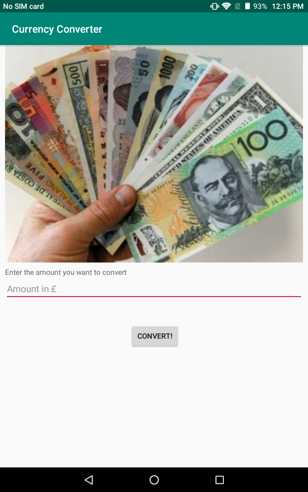
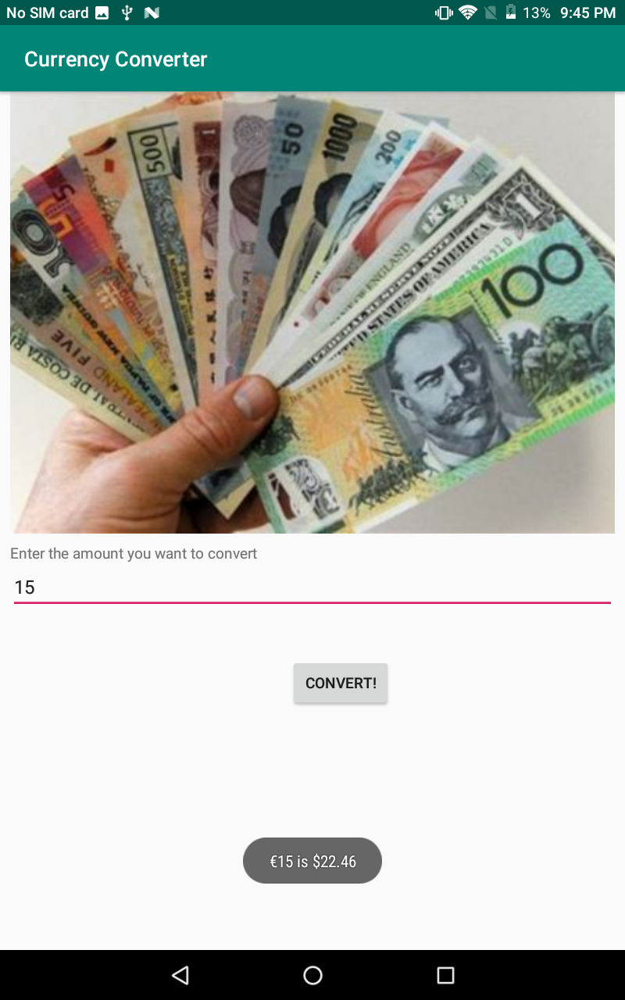

# Currency-Converter
- An app which takes an amount in Euro's (entered by the user) and converts it to an amount in Canadian dollars using an onClick method from a button. 
- The app then uses a thread to create an http connection so that I could get the JSON from the fixer API
- I then appended the JSON to a string to be searched for the CAD conversion rate
- The rate is then parsed to a double to be used to calculate the converted amount in CAD
- Once converted, the converted amount is displayed using a toast. 

