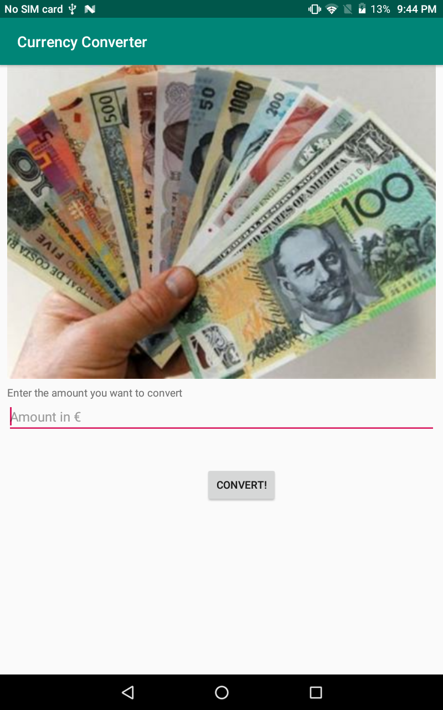

# Currency-Converter
- An app which takes an amount in Euro's (entered by the user) and converts it to an amount in Canadian dollars using a button. Once converted, the converted amount is displayed using a toast. Some modifacations I made ot the app on my own were to include a currency exchange rate API from fixer to get current real world foreign exchange rates in order to convert EUR to CAD.
- Parsed JSON from the fixer API

